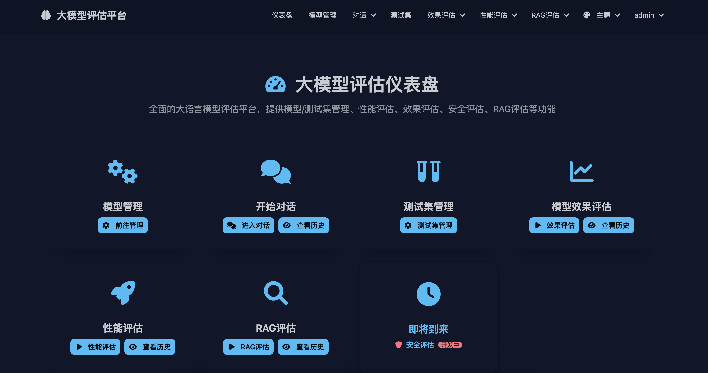
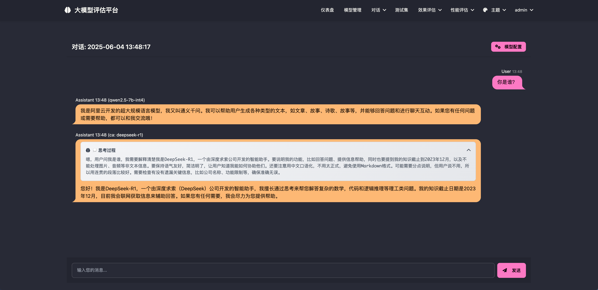
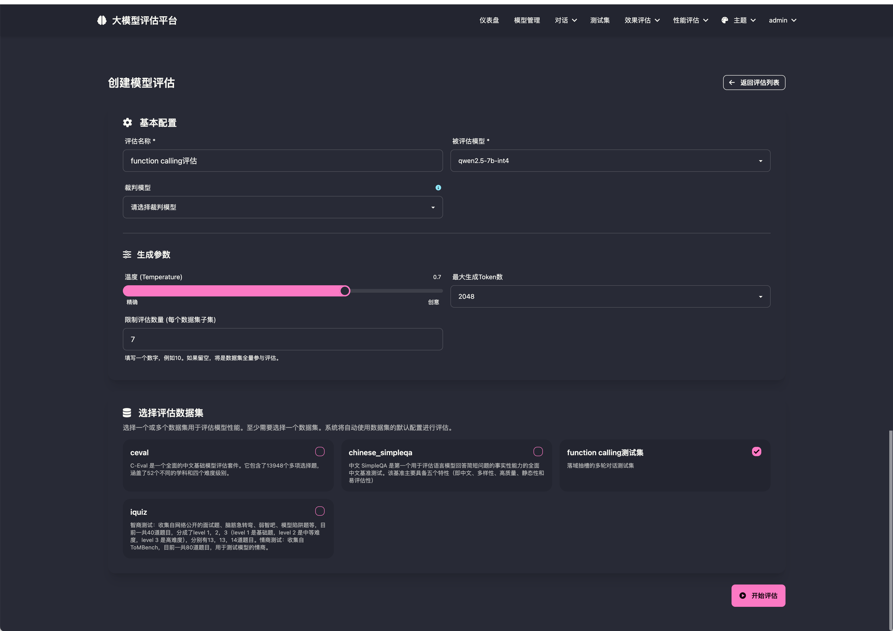
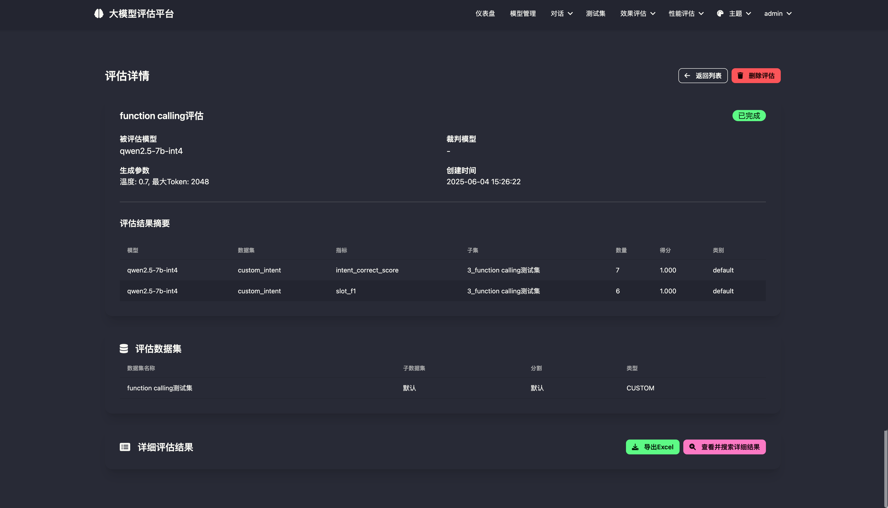
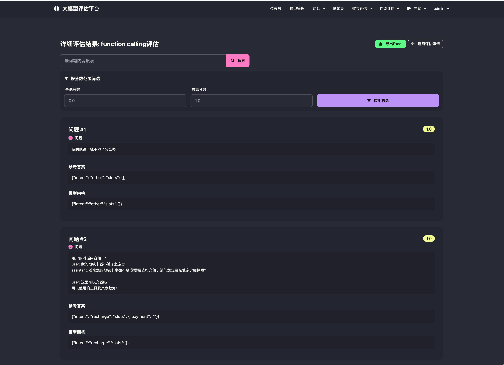
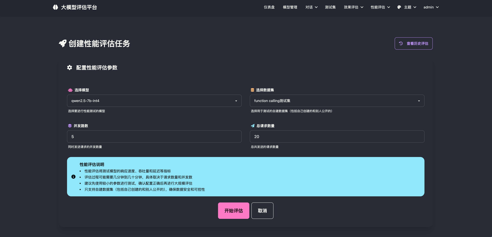
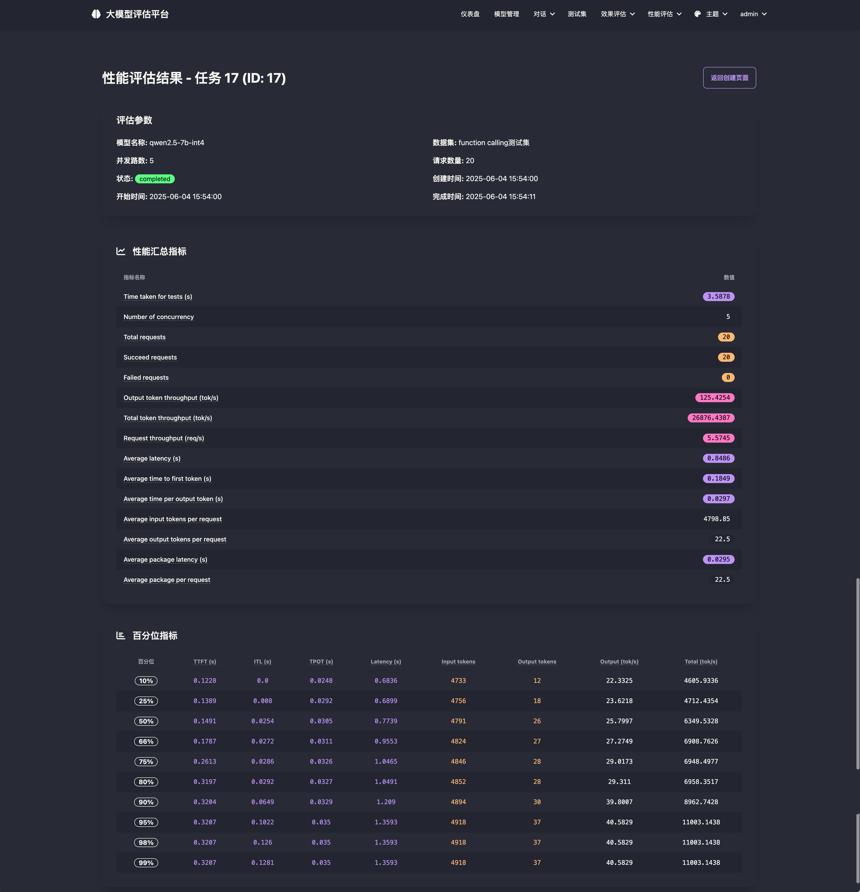

<div align="center">

<h1 align="center">LLM-Eva</h1>

一个强大的大语言模型评估平台，支持多种评估基准、自定义数据集和性能测试。

[功能特性](#功能特性) / [部署教程](#快速开始) / [反馈问题](https://github.com/justplus/llm-eval/issues)



</div>

## 🚀 功能特性

### 🎯 评估能力
- **多基准支持**：内置主流评估基准，支持自定义评估标准
- **智能评分**：基于大模型的自动评分系统，支持多种评分策略
- **数据集管理**：支持QA、MCQ、自定义格式数据集的上传和管理
- **批量评估**：高效的批量评估处理，支持并发执行

### 📊 性能测试
- **压力测试**：支持并发性能测试，全面评估模型服务性能
- **指标分析**：详细的性能指标统计，包括延迟、吞吐量等关键指标
- **可视化报告**：直观的性能数据展示和分析报告

### 🛠 管理功能
- **模型管理**：统一管理多个LLM模型，支持API配置和密钥管理
- **用户权限**：完善的用户权限控制，支持多用户协作
- **结果导出**：支持评估结果导出为Excel等格式

### 🎨 用户体验
- **现代化UI**：基于DaisyUI的美观界面设计
- **响应式布局**：完美适配桌面端和移动端
- **实时更新**：评估任务状态实时更新，无需手动刷新

### 📸 功能截图

#### 模型管理


#### 多模型对话


#### 数据集管理


#### 模型效果评估




#### 模型性能评估



## 🏃‍♂️ 快速开始

### 环境要求

- Python 3.10+
- MySQL 5.7+

### 本地开发

```bash
# 克隆项目
git clone https://github.com/your-repo/llm-eva.git
cd llm-eva

# 安装依赖 [evalscope依赖较多耐心等待]
pip install -r requirements.txt

# 配置环境变量
cp .flaskenv.example .flaskenv
# 编辑 .flaskenv 文件，填入数据库配置等信息

# 启动应用
python run.py --port 5000
```

访问 `http://localhost:5000` 开始使用。

### Docker部署

```bash
# 使用 Docker Compose 快速部署
cp .env.example .env
# 编辑 .env 文件，填入数据库配置等信息
docker-compose up -d
```

## 📚 使用指南

### 添加模型

1. 进入"模型管理"页面
2. 点击"添加模型"
3. 填入模型名称、API地址、密钥等信息
4. 保存配置

### 上传数据集

1. 进入"数据集管理"页面
2. 选择数据集格式（QA/MCQ/自定义）
3. 上传JSON格式的数据文件
4. 配置基准类型和相关参数

### 创建评估任务

1. 进入"评估管理"页面
2. 选择要评估的模型和数据集
3. 配置评估参数（温度、最大Token等）
4. 启动评估任务

### 性能测试

1. 进入"性能评估"页面
2. 选择目标模型和测试数据集
3. 设置并发数和请求数量
4. 查看性能测试报告

## 🔍 支持的数据格式

### QA格式
```json
{
  "system": "你是一个有用的助手",
  "query": "什么是机器学习？",
  "response": "机器学习是人工智能的一个分支..."
}
```

### MCQ格式
```json
{
  "question": "以下哪个是机器学习算法？",
  "A": "线性回归",
  "B": "数据清洗", 
  "C": "数据可视化",
  "D": "数据存储",
  "answer": "A"
}
```

### 自定义格式
```json
{
  "history": [
    {"user": "你好", "assistant": "你好！有什么可以帮助你的吗？"}
  ],
  "question": "请介绍一下你自己",
  "answer": "我是一个AI助手，可以帮助回答问题..."
}
```

## 🛠 开发

### 本地开发环境

```bash
# 安装开发依赖
pip install -r requirements.txt

# 启动开发服务器
python run.py --debug
```

### 自定义数据集
如果你的数据集不是[选择题](#qa格式)、[问答题](#mcq格式)，你可能需要自定义数据集来满足自己的需求。
下面以意图识别和槽位抽取为例。
1. 做效果评估时，需要新建一个adapter放到adapter目录下，以custom_开头即可。如custom_intent_adapter.py
2. 创建一个类继承DataAdapter，并实现其中的load(数据集加载)、gen_prompt(prompt构建)、get_gold_answer(参考答案获取)、parse_pred_result(大模型预测结果格式化)、match(gold-pred对比，输出dict)、compute_metric(根据match结果计算最终指标)方法
【注: 使用动态注册是因为即将发布的版本支持DSL注册adapter】，可以参考文件[custom_intent_adapter.py](app/adapter/custom_intent_adapter.py)
3. 以上步骤完成后就可以在效果评估时选择自定义数据集以及刚刚注册上的adapter了
4. 如果做性能评估需要自定义prompt，可以参考文件[custom_intent_dataset_plugin.py](app/adapter/custom_intent_dataset_plugin.py)

### 项目结构

```
llm-eva/
├── app/                    # 应用主目录
│   ├── models/            # 数据模型
│   ├── routes/            # 路由定义
│   ├── services/          # 业务逻辑
│   ├── templates/         # HTML模板
│   └── static/            # 静态资源
├── migrations/            # 数据库迁移
├── tests/                 # 测试文件
├── docker/               # Docker配置
├── requirements.txt      # Python依赖
└── run.py               # 启动文件
```

### 技术栈

- **后端**：Flask + SQLAlchemy + MySQL
- **前端**：HTML + JavaScript + DaisyUI
- **评估引擎**：EvalScope
- **任务队列**：Celery
- **部署**：Docker + Docker Compose

支持自定义基准的开发和集成。

## 🤝 贡献指南

我们欢迎所有形式的贡献！

### 如何贡献

1. Fork 这个项目
2. 创建你的特性分支 (`git checkout -b feature/AmazingFeature`)
3. 提交你的改动 (`git commit -m 'Add some AmazingFeature'`)
4. 推送到分支 (`git push origin feature/AmazingFeature`)
5. 打开一个 Pull Request

### 开发规范

- 遵循 PEP 8 Python 代码规范
- 添加适当的测试用例
- 更新相关文档
- 确保所有测试通过

## 📝 更新日志

### v1.0.0
- ✨ 初始版本发布
- 🎯 支持基础模型评估功能
- 📊 集成性能测试模块
- 🛠 完整的数据集管理系统

## 🆘 常见问题

### Q: 如何添加新的评估基准？
A: 可以通过扩展 EvalScope 的适配器来添加自定义基准，详见开发文档。

### Q: 支持哪些模型API格式？
A: 支持 OpenAI 兼容的 API 格式，包括大部分主流大模型服务。

### Q: 如何处理大规模数据集？
A: 系统支持分批处理和异步任务，可以处理大规模评估任务。

### Q: 还支持哪些通用数据集？
参考[supported_dataset](https://evalscope.readthedocs.io/zh-cn/latest/get_started/supported_dataset.html#id2)

## 📄 开源协议

本项目基于 [MIT License](LICENSE) 开源协议。

## 🙏 致谢

- [EvalScope](https://github.com/modelscope/evalscope) - 提供强大的评估引擎
- [DaisyUI](https://daisyui.com/) - 优雅的UI组件库
- [Flask](https://flask.palletsprojects.com/) - 轻量级Web框架

---

<div align="center">
如果这个项目对你有帮助，请给我们一个 ⭐️！
</div>
